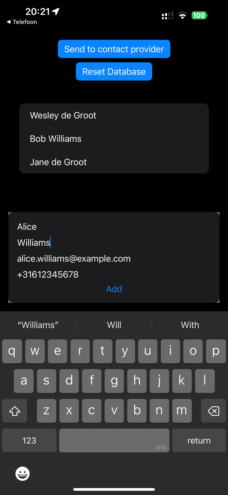
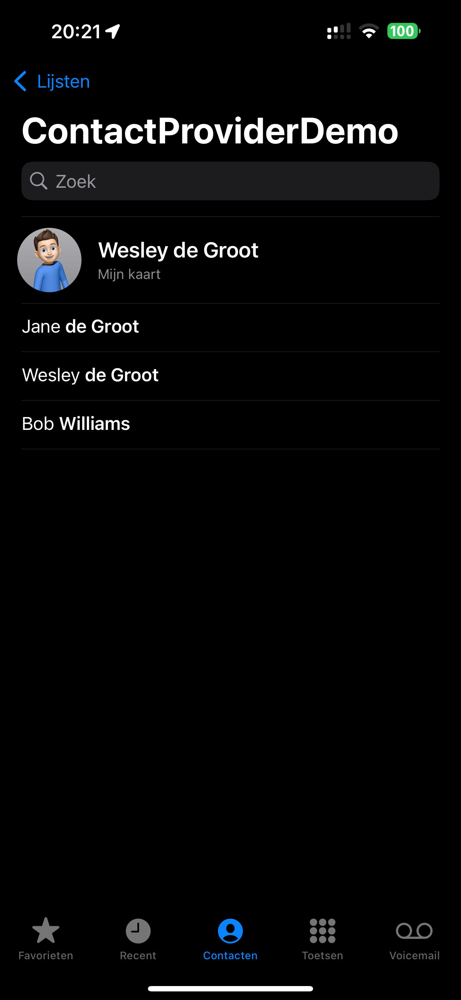
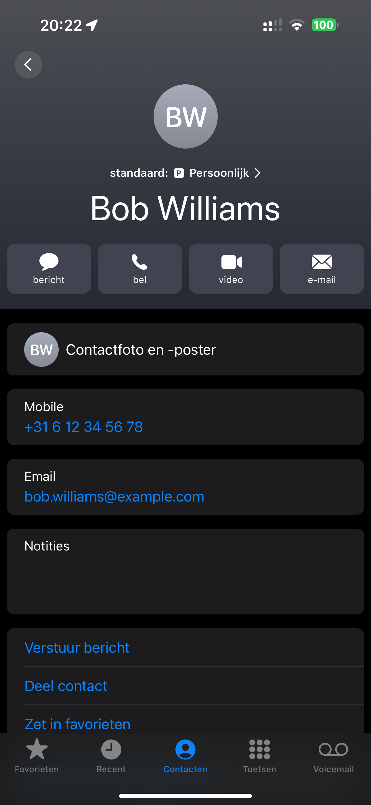

# Contact Provider Extension

This repisitory contains a simple example of a Contact Provider Extension for iOS.
For more information about Contact Provider Extensions, see my blog post at https://wesleydegroot.nl/blog/ContactProvider

## Requirements

- iOS 18+

## Screenshots

<table>
    <tr>
        <td>Application</td>
         <td>Contact list</td> 
    </tr>
    <tr>
        <td></td>
        <td></td>
    </tr>
    <tr>
        <td>Contact item</td>
    </tr>
    <tr>
        <td></td>
    </tr>
</table>

## Contact

🦋 [@0xWDG](https://bsky.app/profile/0xWDG.bsky.social)
🐘 [mastodon.social/@0xWDG](https://mastodon.social/@0xWDG)
🐦 [@0xWDG](https://x.com/0xWDG)
🧵 [@0xWDG](https://www.threads.net/@0xWDG)
🌐 [wesleydegroot.nl](https://wesleydegroot.nl)
🤖 [Discord](https://discordapp.com/users/918438083861573692)

Interested learning more about Swift? [Check out my blog](https://wesleydegroot.nl/blog/).
